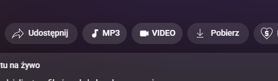
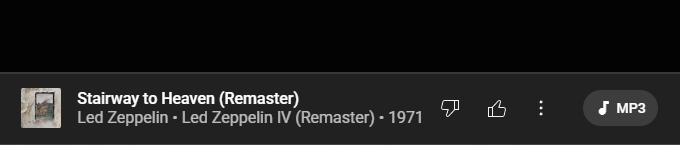

# yt-dlp shortcuts for youtube + music

Tiny webextension that adds buttons that automagically copies a yt-dlp command for the video you are watching right now:

`youtube.com`


`music.youtube.com`


## example result

```bash
yt-dlp "https://music.youtube.com/watch?v=lYBUbBu4W08" -f bestaudio --extract-audio --audio-format mp3 --embed-thumbnail --add-metadata -o "%(artist)s - %(title)s.%(ext)s"
```